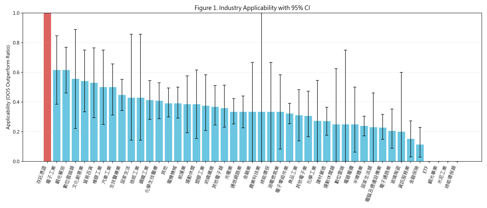
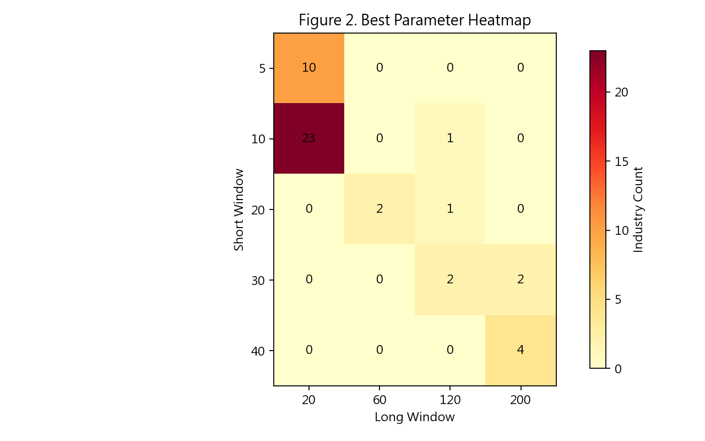

# 產業別視角下均線交叉策略適用性之樣本外檢證：以台灣股票市場為例

## 摘要
本研究檢證均線交叉（moving average crossover, MA cross）策略在台灣股票市場不同產業類別中的樣本外（out-of-sample, OOS）適用性差異。研究採日資料與做多/空手（long/cash）策略，並以持倉位移避免前視偏誤： $position_t = signal_{t-1}$ 。為降低資料探勘偏誤，本研究採「產業別參數最佳化 + 時間切分 OOS 檢證」流程：訓練期（2010-01-01 至 2018-12-31）對每個產業在固定格點 $short\in\{5,10,20,30,40\}$ 、 $long\in\{20,60,120,200\},\,long>short$ 以 Sharpe ratio（ $rf=0$ ）之產業內中位數最大化選取最佳參數 $(s^*_j,l^*_j)$ ；測試期（2019-01-01 至 2025-12-31）將該參數套用於產業內所有股票進行 OOS 評估。主適用性指標定義為產業內股票在測試期「策略總報酬大於 buy-and-hold（BH）總報酬」的比例：

$$
Applicability_j = \frac{1}{N_j}\sum_i \mathbb{1}(TR^{strat}_i>TR^{bh}_i)
$$

並以股票為抽樣單位 bootstrap（ $B=5000$ ）建立 95% 信賴區間、以 $H_1: Applicability_j>0.5$ 計算 one-sided $p$ 值，再以 Benjamini–Hochberg（BH）法進行 FDR 校正（ $q=0.05$ ）。

實證樣本由 `TaiwanStockInfo` 產生全市場 4 碼（上市/上櫃）股票清單共 2129 檔；依交易日數門檻（Train 有效日數 $\ge 504$ ，Test 有效日數 $\ge 252$ ）納入 1678 檔。以 `price_adj_daily` 與交易成本 `fee_bps=10` 的主分析結果顯示：全市場 OOS 打敗 BH 的比例為 0.336；產業間適用性存在差異（介於 0.000 至 1.000，其中「存託憑證」 $N=5$ 為 1.000；其餘產業最高約 0.615），但在多重比較校正後僅「存託憑證」（ $N=5$ ）產業類別達顯著。產業最佳參數呈現高度集中，45 個產業中有 23 個選到 $(short,long)=(10,20)$ 、10 個選到 $(5,20)$ ，顯示在本研究設計下較偏短期均線組合被更常選為最適。

關鍵字：均線交叉、產業別、樣本外檢證、Sharpe ratio、bootstrap、多重比較、台灣股票市場

## 1. 研究動機與問題定義
技術分析策略的有效性常被質疑源自資料探勘與樣本內過度配適；另一方面，產業結構（景氣循環敏感度、波動結構、資訊擴散速度）可能導致同一策略在不同產業中表現差異。若均線交叉屬於趨勢追蹤型策略，其成效可能在趨勢性較強或動能延續性較高的產業中更為顯著。

本研究聚焦下列研究問題（Research Questions, RQ）：
1. RQ1：均線交叉策略的 OOS 適用性是否因產業而異？
2. RQ2：產業最佳化參數 $(short,long)$ 是否呈現系統性差異（例如偏短期或長期趨勢）？
3. RQ3：在控制成本與不同市場階段切分下，產業差異是否仍穩健存在？

## 2. 文獻回顧（簡述）
本研究屬於趨勢追蹤／技術分析策略的樣本外檢證，主要相關議題包括：（1）均線交叉等規則式技術指標在不同市場的可獲利性與樣本外衰減；（2）產業異質性可能透過基本面景氣循環、資訊擴散與投資人結構影響價格趨勢與假訊號；（3）大量參數掃描與多重比較下的偽陽性風險，以及常見的處理方式（樣本外驗證、bootstrap、FDR 控制等）。本研究以「產業別最佳化 + OOS 檢證 + bootstrap 推論 + FDR 校正」降低 data-snooping 與 multiple testing 對結論的影響。

## 3. 資料與樣本
### 3.1 價格資料
- 資料來源：FinMind 日頻資料 `TaiwanStockPriceAdj`，寫入各股票 SQLite：`data/<stock_id>.sqlite` 的 `price_adj_daily` 表。
- 資料清理：排除 `is_placeholder = 1` 之占位資料列；排除 `close` 為空或非正值之資料列。
- 報酬計算：採 close-to-close 日報酬 $ret_t = \frac{close_t}{close_{t-1}} - 1$ 。

### 3.2 產業分類與股票清單
- 股票清單與產業分類來源：FinMind `TaiwanStockInfo`。
- 本研究理想設定為固定採用 2019-01-01 的產業快照；惟該資料源提供的分類日期並非完整歷史快照。本研究以可取得之「最大覆蓋日期」作為參考快照（本次結果為 `2026-03-05`），並在同一股票存在多筆分類時偏好較具體（非總類／非「其他」）的分類。此設計可能引入產業重分類之偏誤，於限制章節說明其可能影響方向。

### 3.3 樣本期間與納入條件
- 全樣本期間：2010-01-01 至 2025-12-31
- 訓練期（Train）：2010-01-01 至 2018-12-31
- 測試期（Test）：2019-01-01 至 2025-12-31

對每檔股票，以有效交易日（排除 placeholder 與缺值）計：
- Train 有效交易日數 $\ge 504$ （約 2 年）
- Test 有效交易日數 $\ge 252$ （約 1 年）
未達門檻者不納入該產業樣本。

本次主分析中，全市場 4 碼上市/上櫃股票共 2129 檔，通過門檻納入 1678 檔（詳見 Table 1 與 `outputs/thesis/universe.csv`）。

## 4. 方法
### 4.1 策略定義（與 `strategies/ma-cross/backtest.py` 一致）
令 $close_t$ 為 $t$ 日收盤價。簡單移動平均（SMA）為：

$$
SMA_{w,t} = \frac{1}{w}\sum_{k=0}^{w-1} close_{t-k}
$$

交易訊號定義為：
- $signal_t = 1$ 若 $SMA_{short,t} > SMA_{long,t}$ ，否則 $signal_t = 0$ 。
- 暖機期（任一 SMA 不可得）強制 $signal_t = 0$ 。

避免前視偏誤，本研究採用持倉位移： $position_t = signal_{t-1}$ 。

策略與基準之日報酬為：
- $ret_t = \frac{close_t}{close_{t-1}} - 1$
- $cost_t = |signal_{t-1} - signal_{t-2}| \cdot \frac{fee\_bps}{10000}$
- $strategy\_ret_t = position_t \cdot ret_t - cost_t$
- $bh\_ret_t = ret_t$

### 4.2 績效指標
年度交易日數採 252、無風險利率 $rf=0$ ：
- Total return：

$$
TR = \prod_t (1 + strategy\_ret_t) - 1
$$

- Sharpe：

$$
Sharpe = \frac{\mathbb{E}[strategy\_ret]}{\sigma(strategy\_ret)}\sqrt{252}
$$

（ $\sigma=0$ 定義為 NaN）

- MDD：

$$
MDD = \min_t\left(\frac{equity_t}{\max_{s\le t} equity_s} - 1\right)
$$

### 4.3 產業別參數最佳化與 OOS 設計
參數格點固定為 $short\in\{5,10,20,30,40\}$ 、 $long\in\{20,60,120,200\}$ 且 $long>short$ 。對每個產業 $j$ 與每一組 $(s,l)$ ：
1. 對產業 $j$ 內每檔股票 $i$ 計算 Train 期 Sharpe： $Sharpe_{i,j}(s,l)$ 。
2. 定義產業分數： $Score_j(s,l) = median_i\, Sharpe_{i,j}(s,l)$ 。
3. 取 $Score_j(s,l)$ 最大者為該產業最佳參數 $(s^*_j,l^*_j)$ 。
4. 同分 tie-break（依序）：（i）Train 期「策略總報酬 > BH 總報酬」之股票比例較高者；（ii） $long$ 較大者。

測試期將 $(s^*_j,l^*_j)$ 套用至產業 $j$ 所有納入股票，並定義每檔股票 OOS 是否打敗 BH：

$$
Outperform_i = \mathbb{1}(TR^{strat}_i > TR^{bh}_i)
$$

產業適用性為：

$$
Applicability_j = \frac{1}{N_j}\sum_i Outperform_i
$$

### 4.4 統計推論與多重比較
對每個產業 $j$ ：
- 以股票為抽樣單位、放回抽樣 bootstrap $B=5000$ 次，得到 $Applicability_j$ 的 95% CI（分位數法）。
- 檢定 $H_1: Applicability_j > 0.5$ ，以 bootstrap 分布估計 one-sided $p$ 值：

$$
p_j = \frac{\#\{Applicability_j^{(b)}\le 0.5\}+1}{B+1}
$$
- 對所有產業 $p$ 值以 Benjamini–Hochberg 法進行 FDR 控制（ $q=0.05$ ），得到 `bh_significant`。

## 5. 實證結果
本節以表圖呈現主要發現；完整中間資料與輸出檔位於 `strategies/ma-cross/outputs/thesis/`。

### Table 1. 樣本描述
（來源：`outputs/thesis/table1_sample_description.csv`）

註：`n_stocks` 為通過納入門檻（Train 有效交易日數 $\ge 504$ 、Test 有效交易日數 $\ge 252$ ）之股票數；`*_days_median` 為有效交易日數中位數（排除 placeholder 與 `close<=0`）。

| industry | n_stocks | train_days_median | test_days_median |
| --- | --- | --- | --- |
| ETF | 9 | 2222.0 | 1699.0 |
| 光電業 | 111 | 2213.0 | 1701.0 |
| 其他 | 87 | 2205.0 | 1700.0 |
| 其他電子業 | 36 | 2220.5 | 1701.0 |
| 其他電子類 | 39 | 2215.0 | 1701.0 |
| 化學工業 | 11 | 2208.0 | 1700.0 |
| 化學生技醫療 | 66 | 2220.5 | 1701.0 |
| 半導體業 | 151 | 2214.0 | 1701.0 |
| 塑膠工業 | 24 | 2223.0 | 1701.0 |
| 存託憑證 | 5 | 2223.0 | 1701.0 |
| 居家生活 | 7 | 2213.0 | 1701.0 |
| 居家生活類 | 13 | 2153.0 | 1681.0 |
| 建材營造 | 85 | 2219.0 | 1701.0 |
| 數位雲端 | 4 | 1694.0 | 1699.0 |
| 數位雲端類 | 9 | 1766.0 | 1692.0 |
| 文化創意業 | 24 | 2092.5 | 1696.5 |
| 橡膠工業 | 12 | 2223.0 | 1699.0 |
| 水泥工業 | 7 | 2222.0 | 1701.0 |
| 汽車工業 | 32 | 2206.5 | 1701.0 |
| 油電燃氣業 | 12 | 2217.5 | 1699.5 |
| 玻璃陶瓷 | 5 | 2223.0 | 1700.0 |
| 生技醫療業 | 76 | 1875.0 | 1701.0 |
| 紡織纖維 | 49 | 2223.0 | 1701.0 |
| 綠能環保 | 9 | 875.0 | 1701.0 |
| 綠能環保類 | 10 | 2051.0 | 1686.0 |
| 航運業 | 26 | 2223.0 | 1701.0 |
| 觀光事業 | 1 | 708.0 | 671.0 |
| 觀光餐旅 | 39 | 1963.0 | 1695.0 |
| 貿易百貨 | 17 | 2216.0 | 1701.0 |
| 資訊服務業 | 33 | 2214.0 | 1701.0 |
| 農業科技業 | 3 | 1345.0 | 1701.0 |
| 通信網路業 | 84 | 2215.0 | 1701.0 |
| 造紙工業 | 7 | 2223.0 | 1701.0 |
| 運動休閒 | 13 | 2190.0 | 1701.0 |
| 運動休閒類 | 8 | 2208.0 | 1696.0 |
| 金融保險 | 35 | 2223.0 | 1701.0 |
| 金融業 | 9 | 2222.0 | 1700.0 |
| 鋼鐵工業 | 46 | 2221.0 | 1701.0 |
| 電器電纜 | 16 | 2211.5 | 1701.0 |
| 電子工業 | 13 | 2196.0 | 695.0 |
| 電子通路業 | 34 | 2222.5 | 1701.0 |
| 電子零組件業 | 189 | 2222.0 | 1701.0 |
| 電機機械 | 82 | 2213.0 | 1701.0 |
| 電腦及週邊設備業 | 101 | 2222.0 | 1701.0 |
| 食品工業 | 29 | 2223.0 | 1701.0 |

### Table 2. 產業最佳化參數與訓練期分數
（來源：`outputs/thesis/table2_best_params.csv`）

註：`train_score_sharpe_median` 為該產業內各股票 Train 期 Sharpe 的中位數；並以此作為產業參數最佳化的目標函數（同分時依 `train_outperform_ratio`、再依 `long` 較大者決定）。

| industry | best_short | best_long | train_score_sharpe_median | train_outperform_ratio |
| --- | --- | --- | --- | --- |
| ETF | 40 | 200 | 0.2873157883392047 | 0.2222222222222222 |
| 光電業 | 5 | 20 | 0.25172775850594353 | 0.8468468468468469 |
| 其他 | 10 | 20 | 0.29600344132115985 | 0.6436781609195402 |
| 其他電子業 | 10 | 20 | 0.37435029147534726 | 0.5277777777777778 |
| 其他電子類 | 5 | 20 | 0.32838051599482504 | 0.5641025641025641 |
| 化學工業 | 5 | 20 | 0.3439181976598013 | 0.6363636363636364 |
| 化學生技醫療 | 10 | 20 | 0.32745920379392723 | 0.7424242424242424 |
| 半導體業 | 10 | 20 | 0.38292942393974644 | 0.7483443708609272 |
| 塑膠工業 | 10 | 20 | 0.44246072599682995 | 0.7916666666666666 |
| 存託憑證 | 5 | 20 | 0.4000289617722108 | 1.0 |
| 居家生活 | 5 | 20 | 0.3308328063518643 | 0.7142857142857143 |
| 居家生活類 | 20 | 60 | 0.521268955029282 | 0.46153846153846156 |
| 建材營造 | 10 | 20 | 0.3251694455395453 | 0.5529411764705883 |
| 數位雲端 | 10 | 120 | 0.43830526149016436 | 0.75 |
| 數位雲端類 | 30 | 200 | 0.35273088680809467 | 0.6666666666666666 |
| 文化創意業 | 5 | 20 | 0.3803782678455738 | 0.7916666666666666 |
| 橡膠工業 | 40 | 200 | 0.36823470620005316 | 0.4166666666666667 |
| 水泥工業 | 40 | 200 | 0.36358539364657755 | 0.5714285714285714 |
| 汽車工業 | 10 | 20 | 0.5270056967789221 | 0.78125 |
| 油電燃氣業 | 30 | 120 | 0.6038469087786262 | 0.0 |
| 玻璃陶瓷 | 10 | 20 | 0.2302796880894629 | 0.8 |
| 生技醫療業 | 10 | 20 | 0.3155521680848083 | 0.6842105263157895 |
| 紡織纖維 | 10 | 20 | 0.3088442109710224 | 0.5306122448979592 |
| 綠能環保 | 5 | 20 | 0.4628472882077415 | 0.5555555555555556 |
| 綠能環保類 | 20 | 60 | 0.20505835493826977 | 0.7 |
| 航運業 | 5 | 20 | 0.08109258444010536 | 0.5769230769230769 |
| 觀光事業 | 30 | 120 | 0.8900414544791494 | 1.0 |
| 觀光餐旅 | 10 | 20 | 0.12788262662964095 | 0.7692307692307693 |
| 貿易百貨 | 10 | 20 | 0.21200849790870724 | 0.8235294117647058 |
| 資訊服務業 | 10 | 20 | 0.3443072955730777 | 0.6060606060606061 |
| 農業科技業 | 40 | 200 | 0.1544785937303452 | 0.6666666666666666 |
| 通信網路業 | 10 | 20 | 0.311005320028936 | 0.7142857142857143 |
| 造紙工業 | 20 | 120 | 0.48688874154753287 | 0.42857142857142855 |
| 運動休閒 | 10 | 20 | 0.5453553364868554 | 0.5384615384615384 |
| 運動休閒類 | 10 | 20 | 0.43076914062581384 | 0.625 |
| 金融保險 | 30 | 200 | 0.5074811916539258 | 0.3142857142857143 |
| 金融業 | 10 | 20 | 0.43205208399489003 | 0.6666666666666666 |
| 鋼鐵工業 | 5 | 20 | 0.31835332598941657 | 0.5652173913043478 |
| 電器電纜 | 5 | 20 | 0.24287201380976495 | 0.625 |
| 電子工業 | 10 | 20 | 0.18241166780760165 | 0.9230769230769231 |
| 電子通路業 | 10 | 20 | 0.3267723644918584 | 0.5294117647058824 |
| 電子零組件業 | 10 | 20 | 0.37867757821493564 | 0.7195767195767195 |
| 電機機械 | 10 | 20 | 0.4011969050279261 | 0.6341463414634146 |
| 電腦及週邊設備業 | 10 | 20 | 0.3132185773144828 | 0.7524752475247525 |
| 食品工業 | 10 | 20 | 0.545725531876621 | 0.5517241379310345 |

### Table 3（主表）. 產業 OOS 適用性比例 + CI + FDR
（來源：`outputs/thesis/table3_applicability_oos.csv`）

註：`applicability` 為 Test 期策略總報酬大於 BH 的股票比例；`ci_low/ci_high` 為 bootstrap 95% CI；`p_value` 為 one-sided 檢定 $H_1: Applicability_j>0.5$ ；`bh_significant` 為 BH-FDR 校正（ $q=0.05$ ）後之顯著性標記。

| industry | n_stocks | applicability | ci_low | ci_high | p_value | bh_significant |
| --- | --- | --- | --- | --- | --- | --- |
| ETF | 9 | 0.0 | 0.0 | 0.0 | 1.0 | 0 |
| 光電業 | 111 | 0.3333333333333333 | 0.25225225225225223 | 0.42342342342342343 | 1.0 | 0 |
| 其他 | 87 | 0.39080459770114945 | 0.2988505747126437 | 0.4942528735632184 | 0.9826034793041392 | 0 |
| 其他電子業 | 36 | 0.3055555555555556 | 0.16666666666666666 | 0.4722222222222222 | 0.99500099980004 | 0 |
| 其他電子類 | 39 | 0.358974358974359 | 0.23076923076923078 | 0.5128205128205128 | 0.968006398720256 | 0 |
| 化學工業 | 11 | 0.2727272727272727 | 0.0 | 0.5454545454545454 | 0.94501099780044 | 0 |
| 化學生技醫療 | 66 | 0.4090909090909091 | 0.2878787878787879 | 0.5303030303030303 | 0.9492101579684064 | 0 |
| 半導體業 | 151 | 0.23841059602649006 | 0.17218543046357615 | 0.304635761589404 | 1.0 | 0 |
| 塑膠工業 | 24 | 0.375 | 0.20833333333333334 | 0.5833333333333334 | 0.9246150769846031 | 0 |
| 存託憑證 | 5 | 1.0 | 1.0 | 1.0 | 0.0001999600079984003 | 1 |
| 居家生活 | 7 | 0.42857142857142855 | 0.14285714285714285 | 0.8571428571428571 | 0.6564687062587482 | 0 |
| 居家生活類 | 13 | 0.23076923076923078 | 0.0 | 0.46153846153846156 | 0.9850029994001199 | 0 |
| 建材營造 | 85 | 0.27058823529411763 | 0.17647058823529413 | 0.36470588235294116 | 1.0 | 0 |
| 數位雲端 | 4 | 0.25 | 0.0 | 0.75 | 0.9478104379124175 | 0 |
| 數位雲端類 | 9 | 0.5555555555555556 | 0.2222222222222222 | 0.8888888888888888 | 0.3625274945010998 | 0 |
| 文化創意業 | 24 | 0.5416666666666666 | 0.3333333333333333 | 0.75 | 0.40531893621275744 | 0 |
| 橡膠工業 | 12 | 0.5 | 0.25 | 0.75 | 0.6052789442111578 | 0 |
| 水泥工業 | 7 | 0.0 | 0.0 | 0.0 | 1.0 | 0 |
| 汽車工業 | 32 | 0.5 | 0.3125 | 0.65625 | 0.5778844231153769 | 0 |
| 油電燃氣業 | 12 | 0.3333333333333333 | 0.08333333333333333 | 0.5833333333333334 | 0.9370125974805039 | 0 |
| 玻璃陶瓷 | 5 | 0.2 | 0.0 | 0.6 | 0.9438112377524495 | 0 |
| 生技醫療業 | 76 | 0.4473684210526316 | 0.34210526315789475 | 0.5526315789473685 | 0.8500299940011997 | 0 |
| 紡織纖維 | 49 | 0.3673469387755102 | 0.24489795918367346 | 0.5102040816326531 | 0.9716056788642271 | 0 |
| 綠能環保 | 9 | 0.3333333333333333 | 0.0 | 0.6666666666666666 | 0.8574285142971406 | 0 |
| 綠能環保類 | 10 | 0.0 | 0.0 | 0.0 | 1.0 | 0 |
| 航運業 | 26 | 0.38461538461538464 | 0.19230769230769232 | 0.5769230769230769 | 0.9188162367526495 | 0 |
| 觀光事業 | 1 | 0.0 | 0.0 | 0.0 | 1.0 | 0 |
| 觀光餐旅 | 39 | 0.6153846153846154 | 0.46153846153846156 | 0.7692307692307693 | 0.07458508298340331 | 0 |
| 貿易百貨 | 17 | 0.5294117647058824 | 0.29411764705882354 | 0.7647058823529411 | 0.39592081583683264 | 0 |
| 資訊服務業 | 33 | 0.15151515151515152 | 0.030303030303030304 | 0.2727272727272727 | 1.0 | 0 |
| 農業科技業 | 3 | 0.3333333333333333 | 0.0 | 1.0 | 0.7270545890821836 | 0 |
| 通信網路業 | 84 | 0.3333333333333333 | 0.2261904761904762 | 0.44047619047619047 | 0.9998000399920016 | 0 |
| 造紙工業 | 7 | 0.42857142857142855 | 0.14285714285714285 | 0.8571428571428571 | 0.6562687462507498 | 0 |
| 運動休閒 | 13 | 0.38461538461538464 | 0.15384615384615385 | 0.6153846153846154 | 0.7996400719856028 | 0 |
| 運動休閒類 | 8 | 0.25 | 0.0 | 0.625 | 0.9734053189362127 | 0 |
| 金融保險 | 35 | 0.11428571428571428 | 0.02857142857142857 | 0.22857142857142856 | 1.0 | 0 |
| 金融業 | 9 | 0.3333333333333333 | 0.0 | 0.6666666666666666 | 0.8552289542091581 | 0 |
| 鋼鐵工業 | 46 | 0.41304347826086957 | 0.2826086956521739 | 0.5434782608695652 | 0.9070185962807439 | 0 |
| 電器電纜 | 16 | 0.25 | 0.0625 | 0.5 | 0.9922015596880623 | 0 |
| 電子工業 | 13 | 0.6153846153846154 | 0.38461538461538464 | 0.8461538461538461 | 0.1941611677664467 | 0 |
| 電子通路業 | 34 | 0.20588235294117646 | 0.08823529411764706 | 0.35294117647058826 | 1.0 | 0 |
| 電子零組件業 | 189 | 0.32275132275132273 | 0.25396825396825395 | 0.3915343915343915 | 1.0 | 0 |
| 電機機械 | 82 | 0.3902439024390244 | 0.2923780487804879 | 0.5 | 0.9822035592881424 | 0 |
| 電腦及週邊設備業 | 101 | 0.22772277227722773 | 0.1485148514851485 | 0.31683168316831684 | 1.0 | 0 |
| 食品工業 | 29 | 0.3103448275862069 | 0.13793103448275862 | 0.4827586206896552 | 0.9802039592081584 | 0 |

### Figure 1. 產業適用性比例（含 95% CI）
（來源：`outputs/thesis/figure1_applicability_bar.png`）

註：長條為 `applicability`、誤差棒為 bootstrap 95% CI；顏色紅色表示 BH-FDR 校正後顯著（`bh_significant=1`），藍色為不顯著。

### Figure 2. 最佳化參數分布（short/long heatmap）
（來源：`outputs/thesis/figure2_best_params_heatmap.png`）

註：每格數字表示選到該組 `(short,long)` 的產業數。

### 主要發現摘要（對應 RQ）
- RQ1（產業差異）：產業適用性比例存在差異（例如「觀光餐旅」「電子工業」達 0.615），但在 bootstrap 檢定與 FDR 校正後，多數產業無法拒絕 $Applicability_j \le 0.5$ ；僅「存託憑證」（ $N=5$ ）在本次設定下達顯著，惟樣本數較小需審慎解讀。
- RQ2（參數結構）：最佳參數高度集中於短期組合，45 個產業中 23 個選到 $(10,20)$ 、10 個選到 $(5,20)$ ；顯示以 Sharpe 中位數最大化的產業最佳化在本市場資料中偏好較短視窗。
- 全市場層級：在 Test 期，納入股票 OOS 打敗 BH 的比例為 0.336（1678 檔中約三分之一）；股票層級的 Test 超額報酬中位數為 -0.308（`test_excess_return`），顯示在本研究成本與訊號定義下策略整體上並未普遍優於 BH。

## 6. 穩健性檢查
本節依 `FIGURE_TABLE_SPECS.md` 定義之三組穩健性輸出提供補充結果。

### R1：成本敏感度（`fee_bps ∈ {0,10,20}`）
以相同資料與流程分別重跑產業最佳化與 OOS 評估，結果顯示成本增加會顯著降低策略 OOS 勝率（見 `outputs/thesis/robust_fee/overall_applicability_by_fee.csv`）：

| fee_bps | n_stocks | overall_applicability |
| --- | --- | --- |
| 0 | 1678 | 0.4088200238379023 |
| 10 | 1678 | 0.3355184743742551 |
| 20 | 1678 | 0.26519666269368297 |

各產業在不同成本下的 `Applicability_j` 詳見 `outputs/thesis/robust_fee/table_applicability_by_fee.csv`。

### R2：價格表替代（`price_adj_daily` vs `price_daily`）
以 `price_daily`（未調整價格）重跑主流程後，整體 OOS 勝率為 0.395（1682 檔；見 `outputs/thesis/robust_table/price_daily/stock_oos_results.csv`）。與 `price_adj_daily` 的差異可由 `outputs/thesis/robust_table/table_compare_adj_vs_raw.csv` 觀察；在本次可取得之樣本下，`applicability_raw - applicability_adj` 的平均差為 0.090、中位數差為 0.061。

### R3：子樣本切分（2010-2014, 2015-2019, 2020-2025）
本研究採「固定產業最佳參數（由主分析 Train 期決定）後，於不同市場階段重估 OOS 打敗比例」作為穩健性呈現（見 `outputs/thesis/robust_subsample/table_applicability_by_subsample.csv`）。全市場層級勝率如下（`outputs/thesis/robust_subsample/overall_applicability_by_subsample.csv`）：

| segment | overall_applicability |
| --- | --- |
| 2010-2014 | 0.6246076585059636 |
| 2015-2019 | 0.5452920143027413 |
| 2020-2025 | 0.366507747318236 |

整體呈現「早期較高、近年下降」之樣貌，與技術策略常見的樣本外衰減或市場效率提升之討論相符，惟此結果仍需結合更完整成本模型與產業分類歷史一致性進一步驗證。

## 7. 討論
主分析顯示多數產業在嚴格的 OOS 檢證與多重比較校正後，並未呈現顯著高於 0.5 的 OOS 適用性比例；換言之，在本研究的參數格點與成本設定下，均線交叉策略不具普遍性的產業優勢。然而，仍可觀察到部分產業（如「觀光餐旅」「文化創意業」）具相對較高的 OOS 勝率，提示產業結構差異可能與趨勢延續性或波動型態相關。

參數最佳化結果高度集中於短期均線組合，顯示在台股日資料中，以 Sharpe 中位數最大化的產業內目標函數傾向選取較短期訊號；然而短期訊號亦通常伴隨較高換手率，R1 的成本敏感度結果亦支持交易成本對策略可用性具有關鍵影響。

## 8. 限制
- 產業分類快照：由於資料源限制，本研究以最大覆蓋日期（2026-03-05）作為產業參考快照，可能引入產業重分類造成的偏誤與潛在前視性；需在後續版本取得更貼近 2019-01-01 的歷史分類以排除此問題。
- 存活者偏誤：若資料未涵蓋退市股票，可能導致樣本偏向存活公司。
- 成本模型簡化：成本以固定 `fee_bps` 表示，未納入稅費、滑價、流動性限制等。
- 策略限制：策略僅做多/空手，未考慮放空、融券與借券限制。

## 9. 結論
本研究以產業別參數最佳化與固定時間切分之 OOS 檢證，評估均線交叉策略在台灣股票市場的產業適用性差異。結果顯示 OOS 適用性比例在產業間存在差異，但在 bootstrap 推論與 FDR 校正後，多數產業不具統計顯著優勢；且最佳化參數多集中於短期均線組合，交易成本對策略勝率具有顯著影響。未來研究可從（1）取得歷史產業分類快照、（2）加入更細緻成本與滑價模型、（3）在更嚴格的樣本外設計（如 walk-forward）下驗證產業差異的穩健性，進一步提升推論可信度。

## 可重現性
- 單檔回測引擎：`strategies/ma-cross/backtest.py`
- 論文批次產生：`python strategies/ma-cross/thesis_pipeline.py`
- 論文輸出目錄：`strategies/ma-cross/outputs/thesis/`

本論文所用之主表圖輸出檔案（CSV/PNG）皆可直接在 `outputs/thesis/` 中對照；更完整的固定化設定與統計細節請見 `THESIS_APPENDIX.md`。

## 參考文獻（待補）
- （依投稿格式補齊）

